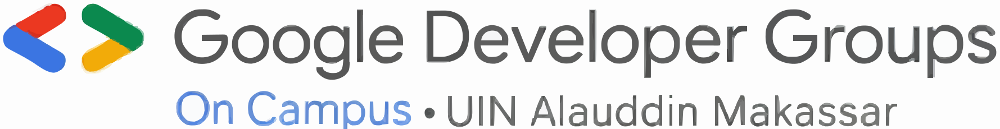

# GDG On Campus UIN Alauddin Makassar

Selamat datang di repositori **Website Resmi GDG On Campus UIN Alauddin Makassar** — sebuah rumah digital tempat ide bertumbuh, kode berkelana, dan komunitas bertemu.

Website ini dibangun untuk mendukung aktivitas komunitas **Google Developer Groups On Campus (GDGOC)** di **UIN Alauddin Makassar**, mulai dari publikasi event, informasi komunitas, hingga autentikasi anggota.

🔗 **Live Website**: https://gdgoc-uinam.web.app/

---

## ✨ Fitur Utama

- 🔐 **Authentication** menggunakan Firebase Authentication
- 📦 **Manajemen Data** berbasis Firebase Firestore
- ⚡ **UI Modern & Responsif** dengan shadcn/ui + Tailwind CSS
- 🧩 Arsitektur komponen modular
- 🚀 Siap dikembangkan untuk event, blog, dan dashboard komunitas

---

## 🧱 Tech Stack

### Frontend
- **React.js**
- **TypeScript (TSX)**
- **Tailwind CSS**
- **shadcn/ui (New York Style)**
- **Lucide Icons**

### Backend & Services
- **Firebase Authentication**
- **Firebase Firestore**
- **Firebase Hosting**

### Package Manager
- **pnpm** (cepat, hemat, modern)

---

## 📐 Konfigurasi UI (shadcn/ui)

```json
{
  "$schema": "https://ui.shadcn.com/schema.json",
  "style": "new-york",
  "rsc": false,
  "tsx": true,
  "tailwind": {
    "config": "",
    "css": "src/index.css",
    "baseColor": "neutral",
    "cssVariables": true,
    "prefix": ""
  },
  "iconLibrary": "lucide",
  "aliases": {
    "components": "@/components",
    "utils": "@/lib/utils",
    "ui": "@/components/ui",
    "lib": "@/lib",
    "hooks": "@/hooks"
  },
  "registries": {
    "@react-bits": "https://reactbits.dev/r/{name}.json"
  }
}
```

---

## 📁 Struktur Proyek (Ringkas)

```
my-gdgoc-app/
├─ public/
│  └─ assets/
│     └─ icon-GDG---bL0196.svg
├─ src/
│  ├─ components/
│  ├─ components/ui/
│  ├─ hooks/
│  ├─ lib/
│  ├─ pages/
│  ├─ index.css
│  └─ main.tsx
├─ firebase/
│  ├─ config.ts
│  ├─ auth.ts
│  └─ firestore.ts
├─ package.json
└─ pnpm-lock.yaml
```

---

## 🚀 Menjalankan Proyek Secara Lokal

### 1. Clone Repository

```bash
git clone https://github.com/mkeyzxi/gdgoc-uinam.git
cd gdgoc-uinam
```

### 2. Install Dependencies

```bash
pnpm install
```

### 3. Konfigurasi Firebase

Buat file `.env` dan isi:

```env
VITE_FIREBASE_API_KEY=xxxxx
VITE_FIREBASE_AUTH_DOMAIN=xxxxx
VITE_FIREBASE_PROJECT_ID=xxxxx
VITE_FIREBASE_STORAGE_BUCKET=xxxxx
VITE_FIREBASE_MESSAGING_SENDER_ID=xxxxx
VITE_FIREBASE_APP_ID=xxxxx
```

### 4. Jalankan Development Server

```bash
pnpm dev
```

---

## ☁️ Deployment

Website ini di-*deploy* menggunakan **Firebase Hosting**.

```bash
pnpm build
firebase deploy
```

---

## 🎯 Tujuan Proyek

- Menjadi pusat informasi resmi GDGOC UINAM
- Media pembelajaran & kolaborasi developer kampus
- Fondasi untuk pengembangan fitur lanjutan (event system, member dashboard, dll)

---

## 🤝 Kontribusi

Kontribusi terbuka untuk seluruh anggota komunitas.

1. Fork repository
2. Buat branch fitur
3. Commit dengan pesan yang jelas
4. Pull Request 🚀

---

## 📜 Lisensi

Proyek ini dibuat untuk keperluan edukasi dan komunitas GDG On Campus UIN Alauddin Makassar.

---

> _"Komunitas adalah kode yang hidup — tumbuh saat dibaca bersama."_

💙 **GDG On Campus UIN Alauddin Makassar**

